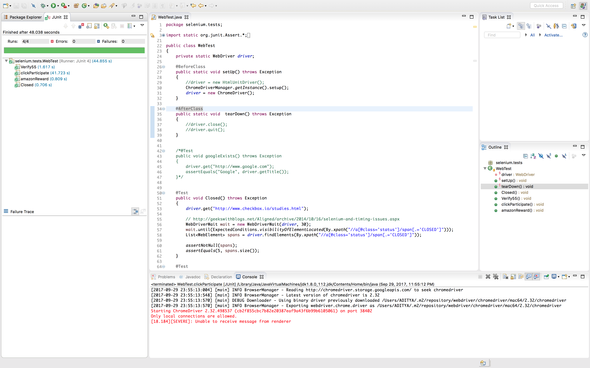

# HW2

## OO Design Pattern

* **Creational Pattern:** Creational patterns emphasize the automatic creation of objects within code, rather than requiring you to instantiate objects directly. In most cases, this means that a function or method can call the code necessary to instantiate new objects on your behalf, so you only need to explicitly modify that object creation when it is necessary, and allow default behaviors to take over otherwise.

* **Structural Pattern:** Structural patterns focus on the composition of classes and objects. By using inheritance and interfaces, these patterns allow objects to be composed in a manner that provides new functionality. In most cases, an interface in object-oriented programming is an abstract type or class which has no logical code, but instead is used to define method signatures and behaviors for other classes that will implement the interface.

* **Behavioral Pattern:** Behavioral patterns are concerned with communication and assignment between objects.

### Creational Pattern

* **Singleton:**

|Explanation|
|:---------|
| Restricts the total number of instances of a particular class to only one at a time. This is commonly used when global access to the object is required across the system, and any changes or queries to the object must be consistent and identical.   |
|**Applicability:**|
|* There must be exactly one instance of a class, and it must be accessible to clients from a well-known access point.  * When sole instnace should be extensible by subclassing i.e., clients can use extended instance without modifying their code.|
|**Example:**|
|LoadBalancing Object: In LoadBalancing systems, only a single instance of a class can be created because servers may dynamically come on or off and every request that comes through the server must go through the one object which has knowledge about the state of the web.|

* **Abstract Factory**

|Explanation|
|:---------|
|Encapsulates groups of factories based on common themes. Often uses polymorphism, the concept in object-oriented programming that allows one interface to serve as a basis for multiple functions of different types.   |
|**Applicability:**|
|1. System should be independent of how its products are created, composed and represented.   2. System should be configured with one of multiple families of products.  3. When we want to reveal the interfaces of the products classes but not their implementation. 4. When we need to design a product where a family of related product objects is designed to be used together.|
|**Example:**|
|InterViews uses "Kit" suffix to denote AbstractFactory classes. It defines WidgetKit and DialogKit abstract factories for generating look-and-feel-specific user interface objects. It also includes a LayoutKit that generates different composition objects depending on the layout desired.|

### Structural Pattern

* **Adapter Pattern**

|Explanation|
|:---------|
|Allows for an interface, which is otherwise incompatible, to be adapted to fit a new class. Typically, this is performed by creating a new ClassNameAdapter class that implements the interface, allowing for compatibility across the system.    |
|**Applicability:**|
|1. When we want to use an existing class and its interface does not match the ones we need.  2. We need reusable classes that cooperates with unrelated or unforseen classes, i.e., classes doesn't necessarily have compatible interfaces.  3. We want to use several existing subclasses, it is tough to have an interface adapt to all of them. Hence, we need an Adapter which can adapt the interface to it's interface classe.|
|**Example:**|
|The best example for the adapter pattern is based around AC power adapters. Say you're visiting Europe from the US, with your laptop, which expects a US power supply. To get your laptop plugged in, you're going to need to get a power adapter that accepts your US plug and allows it to plug in to the European power outlet. The AC adapter knows how to deal with both sides, acting as a middleman - this is the adapter pattern.([source](https://dzone.com/articles/design-patterns-uncovered-0))|

* **Proxy Pattern**

|Explanation|
|:---------|
|Defines a wrapper class for an object, which acts as an interface for the wrapped object. Typically, the proxy class attaches additional behavior onto the wrapped object, without the need to modify the base object class behavior.   |
|**Applicability:**|
|Proxy Pattern is applicable in case of when there is a need for a versatile or sophisticated reference to an object than a simple pointer.|
|**Example:**|
|In the real work a cheque or credit card is a proxy for what is in our bank account.  It can be used in place of cash, which is what is needed, and provides a means of accessing that cash when required. And that's exactly what the Proxy pattern does - controls and manage access to the object they are "protecting".([source](https://dzone.com/articles/design-patterns-proxy))|

### Behavioral Pattern

* **Strategy Pattern**

|Explanation|
|:---------|
|Defines a pattern where logical strategy changes based on the current situation. This is merely an object-oriented extension of common if-else statements, by altering the execution of code based on the outcome of previous code.   |
|**Applicability:**|
|1. when many related classes differ only in their behvaior. Strategies provides a way to configure a class with one of many behaviors.   2. a class defines many behaviors, and these appears as multiple conditional statements in its operations. Instead of many conditionals, move related conditional branches into their own Strategy class.   3. An algorithm uses data that clients shouldn't know about. Use the strategy pattern to avoid exposing complex, algorithm-specific data structures.|
|**Example:**|
|Borland's ObjectiveWindows uses strategies in dialogs boxes to ensure that the user enters valid data. For Example: Numbers might have to be in a certani range, and a numeric entry field should accept only digits. Validating that a string is correct can require a table look-up.|

* **Command**

|Explanation|
|:---------|
|Decouples the actions of the client from the behavior of the receiver. Often through the use of an interface, an object can specify individual behavior when a particular command is invoked, while a different object type can use that same command, but invoke its own unique behavior instead.   |
|**Applicability:**|
|Specify, queue, and execute requests at different times. A Command object can have a lifetime independent of the original request. If the receiver of a request can be represented in an address space-independent way, then you can transfer a command object for the request to a different process and fulfill the request there.|
|**Example:**|
|One example of the command pattern being executed in the real world is the idea of a table order at a restaurant: the waiter takes the order, which is a command from the customer.This order is then queued for the kitchen staff.  The waiter tells the chef that the a new order has come in, and the chef has enough information to cook the meal.|

## Free-Style

|Design Pattern|Explanation|
|:------------:|:---------|
|**MVC Design Pattern**| **Model–view–controller (MVC)** is a software architectural pattern for implementing user interfaces on computers. It divides a given application into three interconnected parts. This is done to separate internal representations of information from the ways information is presented to, and accepted from, the user. The MVC design pattern decouples these major components allowing for efficient code reuse and parallel development.     **Model:** It defines the object in the pattern.   **View:** It represents the visualization of the data in the pattern.   **Controller:** It controls the flow of data into the Model and updates the View whenever data is changed. It also keeps the Model and View separate.   |
|**Service Locator Pattern**| The service locator design pattern is used when we want to locate various services using JNDI lookup. Considering high cost of looking up JNDI for a service, Service Locator pattern makes use of caching technique. For the first time a service is required, Service Locator looks up in JNDI and caches the service object. Further lookup or same service via Service Locator is done in its cache which improves the performance of application to great extent. Following are the entities of this type of design pattern.([source](https://www.tutorialspoint.com/design_pattern/service_locator_pattern.htm))     |
|**Interpreter Pattern**| Defines a series of classes used to interpret language syntax from a provided sentence. Typically, each symbol is defined by one class, and then a syntax tree is used to parse (interpret) the overall sentence.     **Applicability:**   Use Interpreter pattern when there is a language to interpret, and you can represent statements in the language as abstract syntax trees. Interpreter works best when   1. Grammer is simple.   2. Efficiency is not a critical concern.     |

## Selenium Test Results:

The Code for the Selenium task in is given in this [link](./Selenium)

## Resources:
* [Design Pattern Guid - Airbrake.io](https://airbrake.io/blog/design-patterns/software-design-patterns-guide)
* Elements of Reusable Object-Oriented Software [Design Pattern]: Erich Gamma, Richard Helm, Ralph Johnson, John Vlissides
